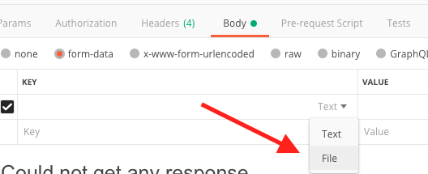

To run locally with Python virtual environment:

get Gemini API Key via google aistudio --> https://aistudio.google.com/welcome 

```
cd app 
create `.env` file
add GEMINI_API_KEY key ( key=value format ) 

```
**DO NOT COMMIT ANY .ENV FILES!**

```
cd app
python -m venv venv
source venv/bin/activate
python -m pip install -r requirements.txt
```

start server with  ```uvicorn main:app --reload```


Once app is running you can test using swagger openAPI `/docs` endpoint at `localhost:8000/docs`, just select the method from dropdown and then hit `try it out` 

To test API with Postman: 


Install Postman --> https://www.postman.com/downloads/
<br>
set address to `localhost:8000/analyze_fabrics` method is `POST`
<br>
  <br>
 upload files via `form-data` then `files`
